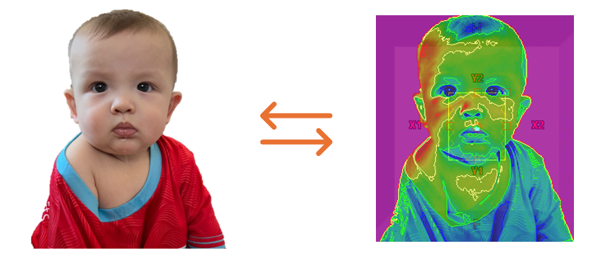
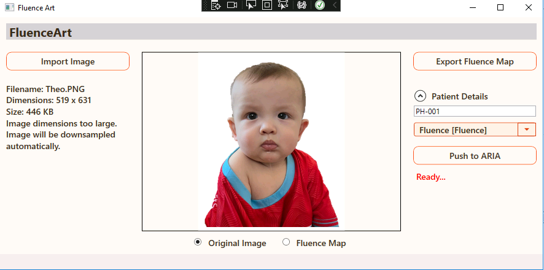

# FluenceArt

**FluenceArt** is a WPF-based Eclipse scripting application that converts user-imported images into normalized fluence maps. Designed for physicists and radiotherapy professionals, it allows users to visualize fluence maps as heat maps, export the data in a custom format, and even integrate directly with ARIA patient records.

### Please Note: This tool is not intended for patient treatment. This tool is a novelty for fun experiments.



## Features

- **Image Import:** Supports various image formats (PNG, JPEG, BMP, GIF, TIFF).
- **Fluence Map Conversion:** Converts images into a normalized fluence map (2D float array).
- **Downsampling:** Automatically downsamples images that exceed a 20 cm physical width to conform to MLC field size limitations.
- **Heat Map Preview:** Displays a heat map visualization where the highest fluence values are shown in red and lower values in blue.
- **Export Functionality:** Exports the fluence map to a text file with a specific header and data format.
- **ARIA Integration:** (Optional) Pushes the generated fluence map into a patient record in ARIA.
- **MVVM Architecture:** Built on the MVVM pattern using WPF for clean separation of concerns.

## Getting Started

### Prerequisites

- This application is available in V15.6, V16.1, and V18.1 of Eclipse.
- Applications utilizes .NET Framework 4.5, 4.6.1 and 4.8 for the versions of Eclipse listed above.
- Patient ID may be passed in with input argument or not.

### Installation

1. **Clone the repository:**

   ```bash
   git clone https://github.com/yourusername/FluenceArt.git
   ```

2. **Open the Solution:**

   Open `FluenceArt.sln` in Visual Studio and restore any NuGet packages.

3. **Build the Application:**

   Build the solution using Visual Studio (Build -> Build Solution).

### Running the Application

- Launch the application (Debug -> Start Debugging or press F5).
- Use the UI to import an image, preview the fluence map, and perform the export or ARIA integration.

## Usage

1. **Import Image:**  
   Click the **Import Image** button to load an image file. The tool supports multiple file types such as PNG, JPEG, BMP, GIF, and TIFF.

2. **Preview and Conversion:**  
   The application converts the image to a normalized fluence map and displays it as a heat map. Use the toggle options to switch between the original image and the heat map view.

3. **Downsampling:**  
   If the imported image exceeds a physical width of 20 cm (based on a sampling of 2.5 mm per pixel), the tool automatically downsamples the image by half to ensure compatibility with MLC field size limits.

4. **Export Fluence Map:**  
   Click **Export Fluence Map** to save the generated fluence map.

5. **Push to ARIA:**  
   If desired, enter the patient details and click **Push to ARIA** to integrate the fluence map into the ARIA system. Please note, the script would need approval prior to using this feature in a Clinical Eclipse system. 



## Code Structure

- **Views:** Contains XAML files for the UI (e.g., `MainView.xaml`).
- **ViewModels:** Implements MVVM logic and commands (e.g., image import, conversion, export).
- **Models:** Data models for fluence maps and patient details.
- **Helpers:** Utility classes for image processing, conversion (e.g., `FluenceConverter.cs`, `FluenceExporter.cs`, `ImageResizer.cs`).

## Example Code Snippets

### Image Import and Conversion

```csharp
private void OnImportImage(object obj)
        {
            OpenFileDialog openFileDialog = new OpenFileDialog
            {
                Filter = "Image Files (*.png;*.jpg;*.jpeg;*.bmp;*.gif;*.tif;*.tiff)|*.png;*.jpg;*.jpeg;*.bmp;*.gif;*.tif;*.tiff|All Files (*.*)|*.*"
            };

            if (openFileDialog.ShowDialog() == true)
            {
                string filePath = openFileDialog.FileName;

                try
                {
                    // Load the image into a BitmapImage.
                    BitmapImage bitmap = new BitmapImage();
                    bitmap.BeginInit();
                    bitmap.UriSource = new Uri(filePath);
                    bitmap.CacheOption = BitmapCacheOption.OnLoad; // ensures the file is closed after load
                    bitmap.EndInit();
                    bitmap.Freeze(); // makes it cross-thread accessible

                    ImageSource = bitmap;
                    _originalImage = bitmap;
                    // Retrieve file info and update details string.
                    FileInfo fileInfo = new FileInfo(filePath);
                    ImageDetails = $"Filename: {fileInfo.Name}\n" +
                                   $"Dimensions: {bitmap.PixelWidth} x {bitmap.PixelHeight}\n" +
                                   $"Size: {fileInfo.Length / 1024} KB";
                    if(bitmap.PixelWidth>80 || bitmap.PixelHeight > 80)
                    {
                        ImageDetails += $"\nImage dimensions too large.\nImage will be downsampled automatically.";
                    }
                    FluenceModel fluenceModel = FluenceConverter.ConvertImageToFluenceMap(bitmap);
                    fluence = fluenceModel.Fluence;
                    origin = fluenceModel.Origin;
                    _fluenceImage = FluenceConverter.ConvertFluenceMapToHeatMap();
                    ExportToFileCommand.RaiseCanExecuteChanged();


                    if (SelectedPlan == null)
                    {
                        PushMessage = "Select a plan to push to ARIA";
                    }
                }
                catch (Exception ex)
                {
                    // Update the details string with error information.
                    ImageDetails = $"Error loading image: {ex.Message}\n{ex.InnerException}";
                }
            }
        }
```

### Concert Image to Bitmap

```csharp
        /// <summary>
        /// Converts a given BitmapSource into a fluence map array.
        /// The fluence map is a 2D array of floats normalized to a maximum value of 1.0.
        /// The resolution is fixed at 2.5mm (0.25cm) per pixel.
        /// The origin is calculated as half the size of the fluence map (in pixels) multiplied by the resolution.
        /// </summary>
        /// <param name="source">The source image to convert.</param>
        /// <returns>A tuple containing the fluence map (float[,]) and the origin (Point).</returns>
        public static FluenceModel ConvertImageToFluenceMap(BitmapSource source)
        {
            if (source == null)
                throw new ArgumentNullException(nameof(source));
            LocalFluence = new FluenceModel();
            // Ensure the image is in a grayscale format (Gray8) for a single intensity value per pixel.
            BitmapSource graySource = DownsampleIfTooLarge(source);
            if (source.Format != PixelFormats.Gray8)
            {
                graySource = new FormatConvertedBitmap(graySource, PixelFormats.Gray8, null, 0);
            }

            int width = graySource.PixelWidth;
            int height = graySource.PixelHeight;

            // Allocate an array to receive pixel data.
            byte[] pixels = new byte[width * height];
            graySource.CopyPixels(pixels, width, 0);

            // Determine the maximum pixel value to use for normalization.
            byte maxPixel = 0;
            foreach (byte pixel in pixels)
            {
                if (pixel > maxPixel)
                    maxPixel = pixel;
            }
            // Prevent division by zero.
            if (maxPixel == 0)
                maxPixel = 1;

            // Create the fluence map as a 2D float array.
            float[,] fluence = new float[height, width];
            for (int y = 0; y < height; y++)
            {
                for (int x = 0; x < width; x++)
                {
                    byte pixelValue = pixels[y * width + x];
                    // Normalize pixel value to the range [0, 1].
                    float normalizedValue = pixelValue / (float)maxPixel;
                    fluence[y, x] = normalizedValue;
                }
            }

            // Define the resolution: 2.5mm per pixel = 0.25cm per pixel.
            float resolution = 2.5f; // in mm

            // Calculate the origin position.
            // The formula used here is: originX = -((width - 1) / 2) * resolution, originY = ((height - 1) / 2) * resolution.
            // This positions the center (or near center) of the fluence map about the isocenter.
            float originX = -((width - 1) / 2.0f) * resolution;
            float originY = ((height - 1) / 2.0f) * resolution;
            Point origin = new Point(originX, originY);
            //set local fluence
            LocalFluence.Fluence = fluence;
            LocalFluence.Origin = origin;
            return new FluenceModel()
            {
                Fluence = fluence,
                Origin = origin
            };
            //return (fluenceMap, new Point(originX, originY));
        }
```

## License

This project is licensed under the MIT License – see the [LICENSE](LICENSE) file for details.

## Contact

For questions or feedback, please open an issue or contact [Matthew Schmidt](mschmidt@gatewayscripts.com).

---

Feel free to modify or extend this README to fit your project’s needs. Happy coding!
